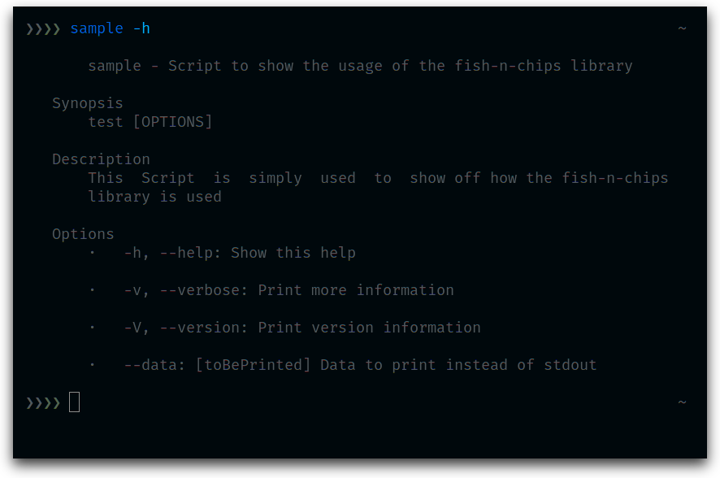
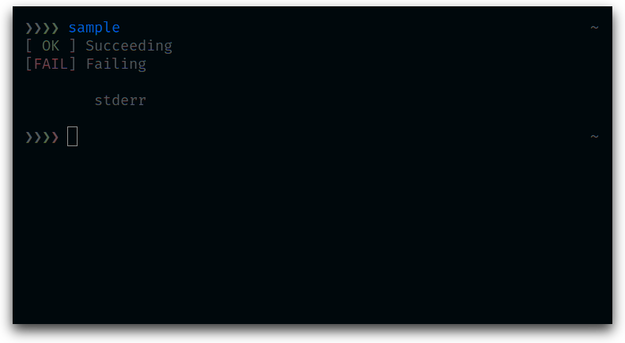
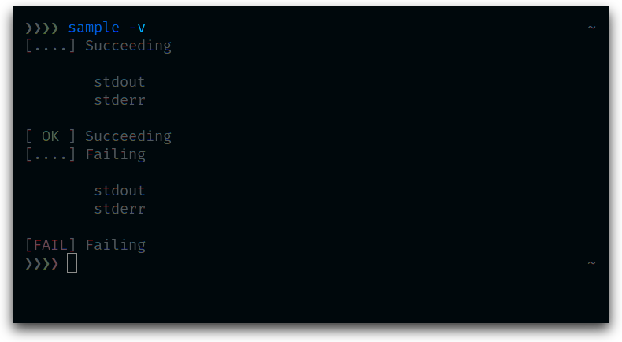
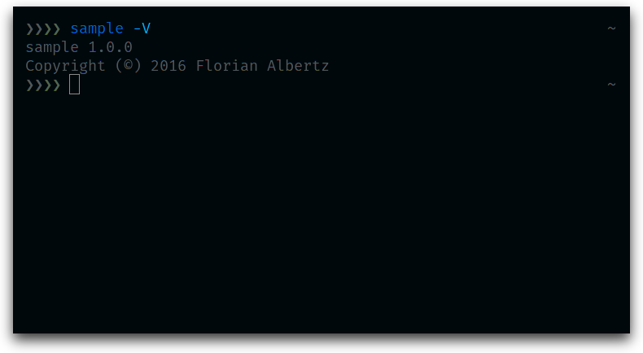

# fish-n-chips
A utility library to write fish shell scripts.
It handles argument parsing as well as help page generation and brings with it some tools to structure your script.

## Example
**[sample.fish](sample/sample.fish)**:

```fish
# Define our application
name        sample
version     1.0.0
author      Florian Albertz
copyright   2016

info        'Script to show the usage of the fish-n-chips library'
synopsis    'test [OPTIONS]'
description 'This Script is simply used to show off how the `fish-n-chips` library is used'

argument    '-h | --help          Show this help'
argument    '-v | --verbose       Print more information'
argument    '-V | --version       Print version information'
argument    '--data [toBePrinted] Data to print instead of `stdout`'

arg -h help; and exit
arg -V printVersion; and exit

if arg -v
	set chipsVerbose true
end

function printSomething
	echo (stern (arg --data) 'stdout')
	error stderr
	return $argv[1]
end

run "Succeeding" printSomething 0
run "Failing" printSomething 1
```

**Output**






## Installation
I suggest installing this library as a git submodule:

```fish
git submodule add git@github.com:PaulAvery/fish-n-chips.git chips
```

You can obviously install it differently as well. The only important part is, that you execute the following at the top of your script:

```fish
set chipsPwd (dirname (realpath (status -f)))
source $chipsPwd/chips/chips.fish $argv; or exit $status
```

We set the `chipsPwd` variable so the library knows where to find things like our *ReadMe.md*. Then we source the entry file *chips.fish* and pass it all our arguments. The `; or exit $status` is simply used, so our script aborts if the library encounters an error.

## Documentation
Explanations about the specific features can be found in the [docs](docs) folder. The following topics might be good entry points:

  * [CLI Options](docs/argv.md)
  * [Help-/Manpage Generation](docs/help.md)
  * [Program Flow](docs/run.md)
  * [Utility Functions](docs/utils.md)
